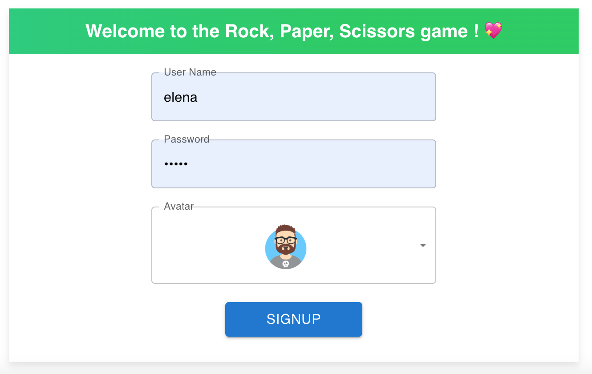
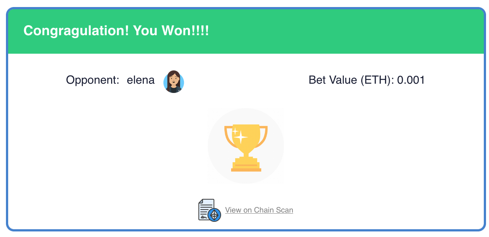
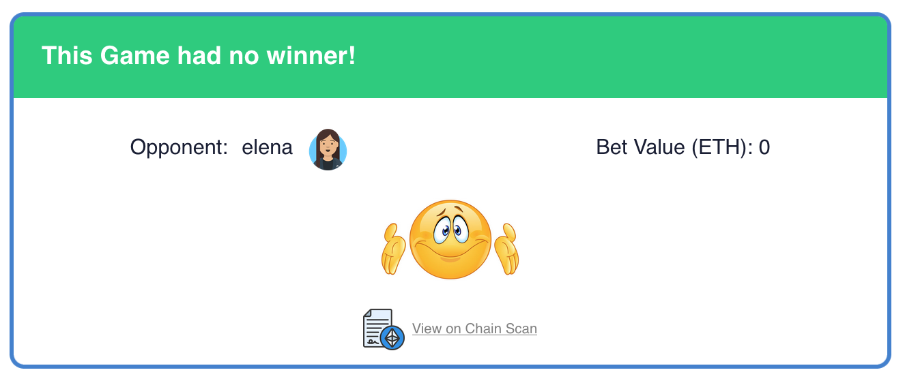

# CryptoRPS Warriors

Welcome to CryptoRPS Warriors, a blockchain-based twist on the classic Rock-Paper-Scissors game with an exciting 5-move variant! In this decentralized application (dApp), players can sign up, connect their wallet addresses, and challenge others to strategic duels. Each game is managed by a smart contract, ensuring fairness and transparency. Players can engage in multiple games simultaneously, with every move and result being securely recorded on the blockchain. Whether you're a blockchain enthusiast or a casual gamer, CryptoRPS Warriors offers a unique blend of strategy and technology. Join the battle, deploy your moves, and prove your prowess in this innovative and secure gaming arena!

# Project Description

CryptoRPS Warriors is a blockchain-based twist on the classic Rock-Paper-Scissors game, featuring an exciting 5-move variant. This decentralized application (dApp) is built using React.js, Thirdweb, and Viem libraries for blockchain interactions, with an Express.js backend. The backend stores and retrieves user and game information and manages user and wallet authentications and authorizations. All game actions are managed by smart contracts. Now, it only support Sepolia network but it can easily work on other networks by small changes.

## Technologies Used

- Frontend: React.js
- Blockchain Libraries in front-end: Thirdweb, Viem
- Backend: Express.js
- Blockchain Libraries in back-end: Etherjs
- User authenticaton in back-end: Passport
- Event management: Socket.io, socket.io-client

## Workflow

- User Signup and Wallet Connection:
  Users sign up in the application with a username, password. Then, users can connect their wallets using the Thirdweb wallet connect module, which supports over 300 different types of wallets, including email and custodial wallets.
  A cryptographic nonce is sent from the backend, which the user signs with their wallet. The signed message is sent back to the backend for verification and wallet authorization.

- Starting a New Game:
  After authorization, users can start new games by selecting an opponent and a move (one of five possible moves), and setting a bet value.
  A new RPS game contract is deployed on the blockchain with the stake value. The game information and contract address are sent to the backend. The backend notifies the opponent of the new game with a socket event.

- Gameplay:
  The opponent can select his move and pays the stake value set by the first user. If the opponent doesn't respond within 5 minutes, first player can cancel the game by calling the "j2timeout" function, and the stake is returned to the first user.
  The opponent can select a move by calling "play" function of the contract. If the opponent makes his move, the first user must confirms his initial move by calling the "solve" function of the contract to determine the winner.
  If there is no winner, the stake is returned to both users. If the first player does not confirm his move within 5 minutes, the opponent can call the "j1timeout" function and win the game.

## Security Measures

For security reasons, the first player's move is never saved in the contract, as this would allow the opponent to check the blockchain and always choose a winning move. Instead, the first player's move is hashed with a cryptographic nonce using the SHA-1 algorithm, and this hash value is saved in the contract. After the opponent makes their move, the first player reveals their initial move and hash value in the confirm function. The contract then verifies the initial hash and determines the winner. To ensure security, the nonce value should be large enough to prevent brute-force attacks or dictionary attacks. Additionally, the first player cannot find another move with a different nonce that has the same hash.

## How to setup and test

To set up the project, follow these steps:

You first need to clone and run back-end project from this repository `https://github.com/n-mazaheri/CryptoRPS-Warriors-Backend`

1. Clone the repository: `git clone https://github.com/n-mazaheri/CryptoRPS-Warriors`
2. Navigate to the project directory: `cd CryptoRPS-Warriors`
3. Install dependencies: `npm install --force`
4. Add a .env file to the project with any desired value for these two keys

- REACT_APP_BASE_URL=> url of back-end code you already run `http://localhost:3000`
- REACT_APP_THIRDWEB_ID => Thirdweb key

5. Start the project: `npm start`

To build the project, run the following command, and use the build folder inside the image-editor directory:
`npm run build`

## Game Steps

1- User signup in the app\

2- User connect to his wallet\

3- User select his oponent, initial move and stake value and then create new game\

4- If the opponent doesn't respond within 5 minutes, user can cancel the game\

5- The oponent can select his move\

6- User should confirm his initial move (Initial move and nonce value are saved in local storage to help user dont forgot)\

7- If the first player does not confirm his move within 5 minutes, the opponent can cancel and win the game\

8- We have three different result: win, lose and no winner\
\
\

